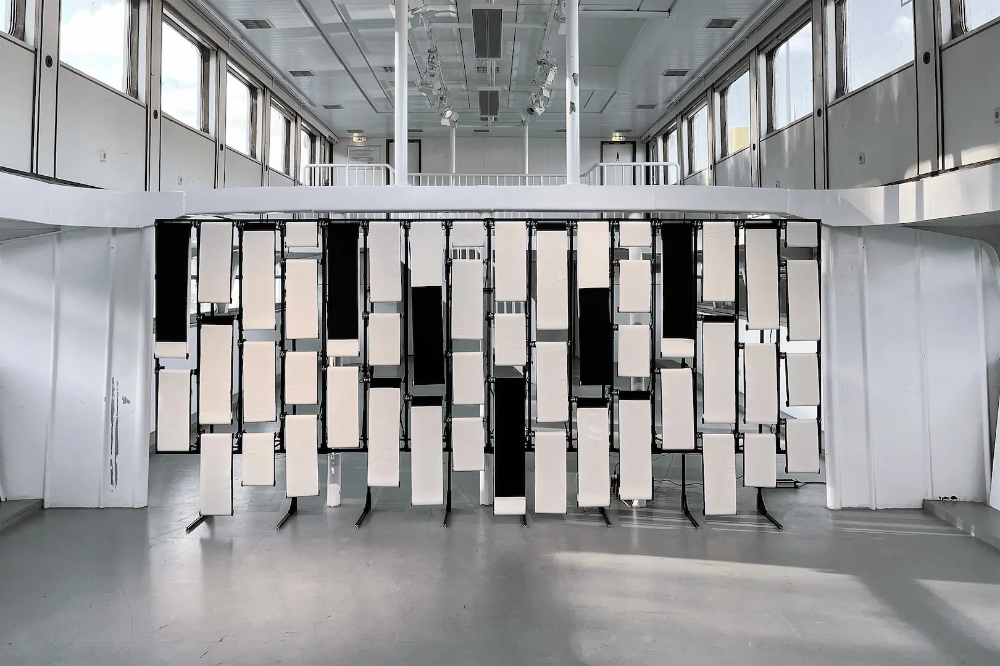
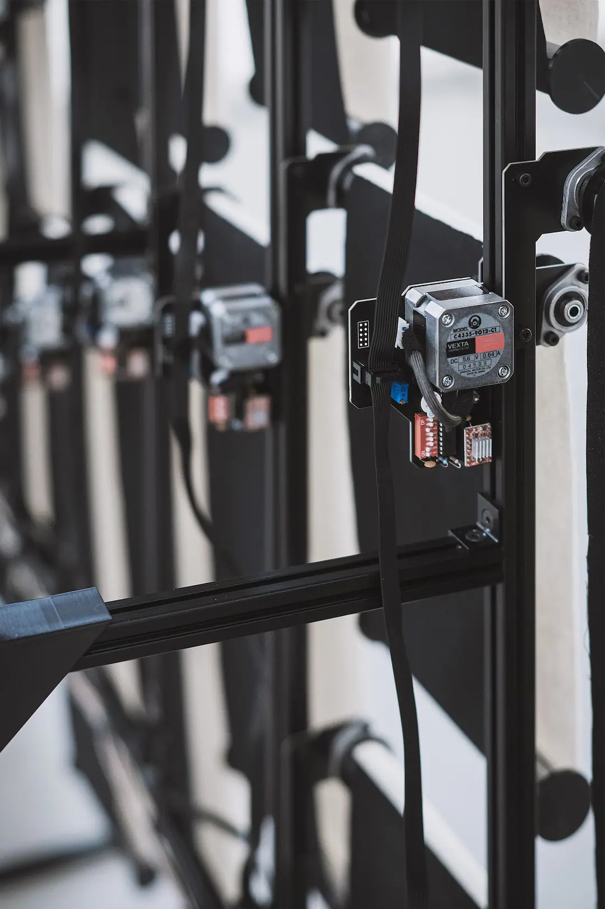
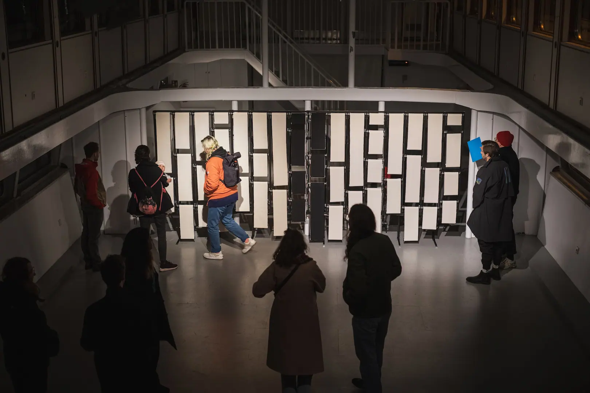
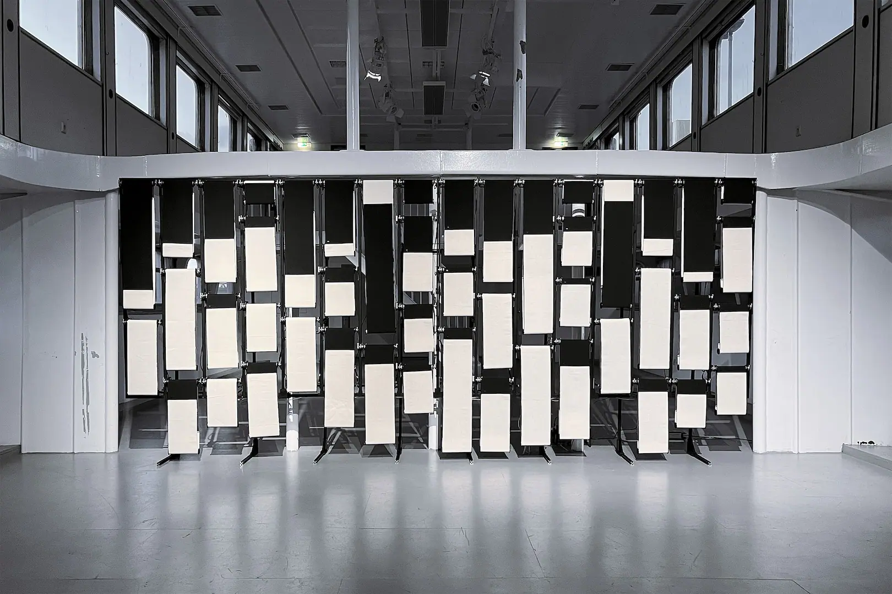
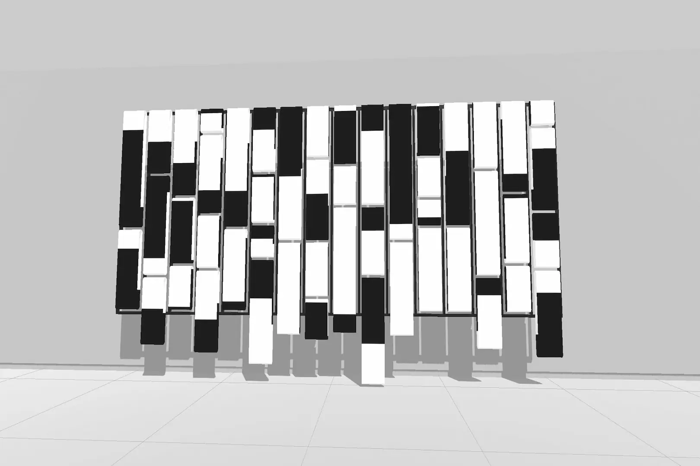

# Phase

Phase is a kinetic and sonic installation that generates visual and auditory patterns through physical changes. The project was completed in October 2023. Drawing on the history of materials in art, such as tapestry and painting, I used a mechanized frame and fabric as the medium. My aim was to create a dynamic and immersive experience for the audience that could be read in a multitude of ways.

The installation Phase presents audiovisual quality through a performative act, where information emerges from noise and then disappears. An inseparable sensual coupling of image and sound is created by the inherent connection between the optical and mechanical possibilities of the actuators. Phase is a wall-sized kinetic installation of motorized fabric loops arranged in a columnar grid that combines the visual level of abstract painting with the time-based characteristics of music and experimental film. Although the imagery can be associated with Minimalism, Constructivism, or related movements, the performative act derives its meaning from its relationship to contemporary media art. Phase offers a unique experience in which matter and information merge.

The piece consists of 47 modules made from motorized electronics and fabric loops of varying lengths, set within a 450 cm × 200 cm metal skeleton. Each module communicates with a central algorithm that creates a 17-minute performance from isolated movements. The slow changes in visuality manifest themselves sonically in dramatic chord progressions that give the performance an organ or string feel. A shape emerges from black and remains in motion. Dynamic patterns such as squares and stripes, altered by cellular automata or other mathematical approaches, give the work a generative intricacy – a play with complexity. Phase offers the audience the opportunity to question their cognitive processes: where is the threshold between noise and signal? After various audiovisual intensifications, the performance returns to its original state in a meditative deceleration.

[Phase Simulation](https://player.vimeo.com/video/874696401?h=419a94173b&title=0&byline=0&portrait=0 ":include :type=iframe width=100%")

Half coloured in black and white, the loops allow Phase to change its entire appearance in intermediate steps by rotating. The rotation of the canvas-like fabric loops on the rollers is controlled by magnetic sensors, allowing a precise configuration of the image. Microcontrollers use musical frequencies in the form of a 12-step Western chromatic scale to drive the motors at a set speed. A skeleton of aluminium profiles arranges these modules to create the overall appearance. Phase is a free-standing or wall- mounted installation.

