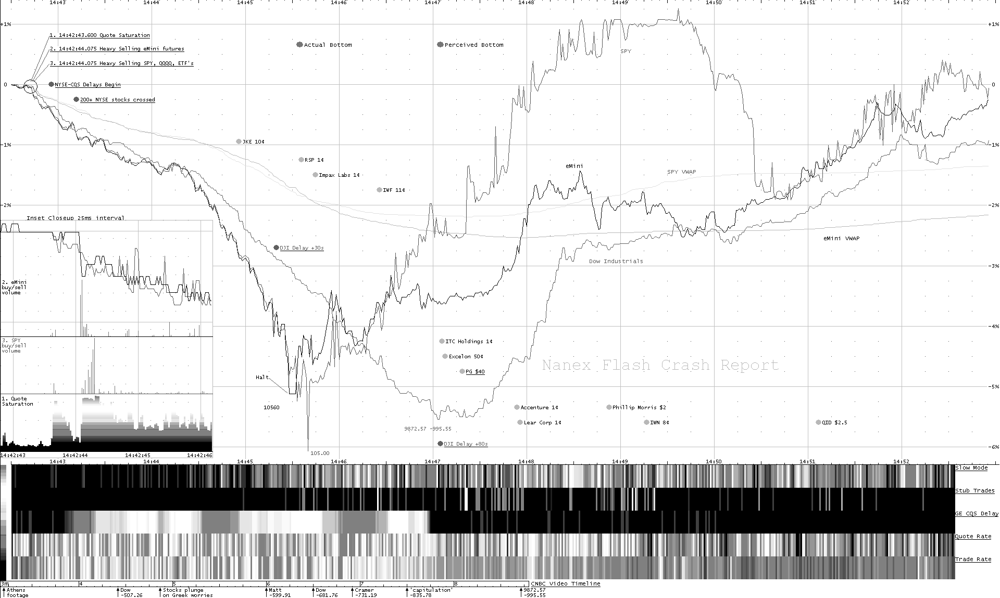
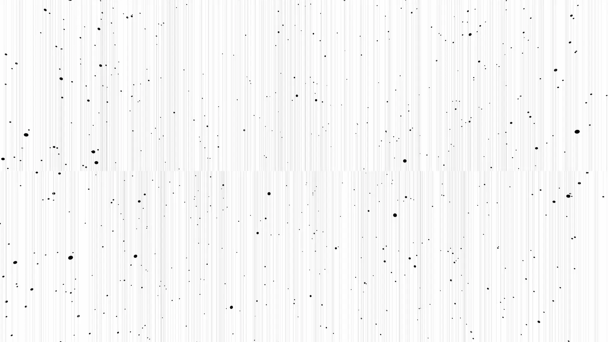
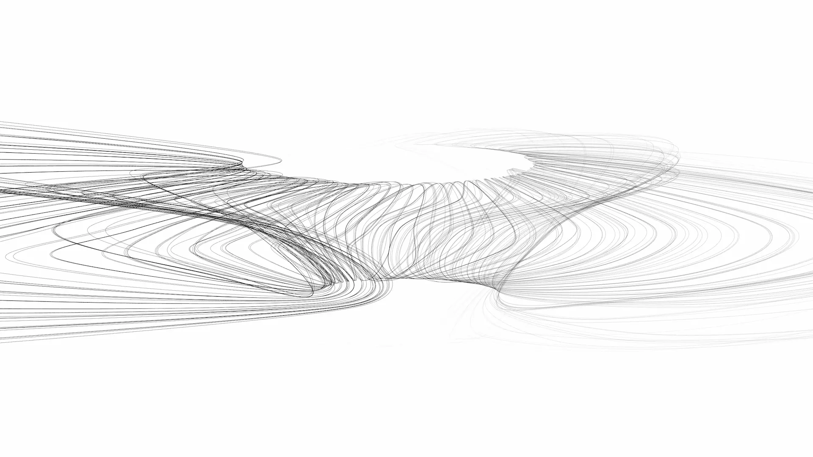
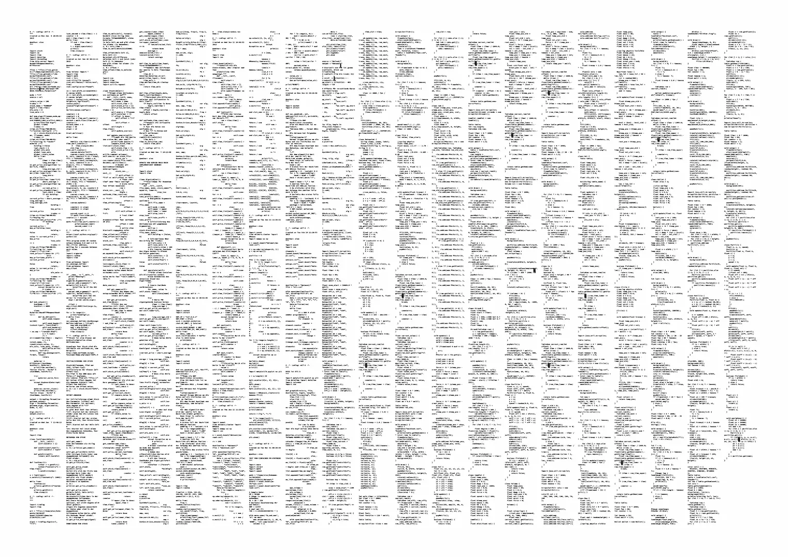
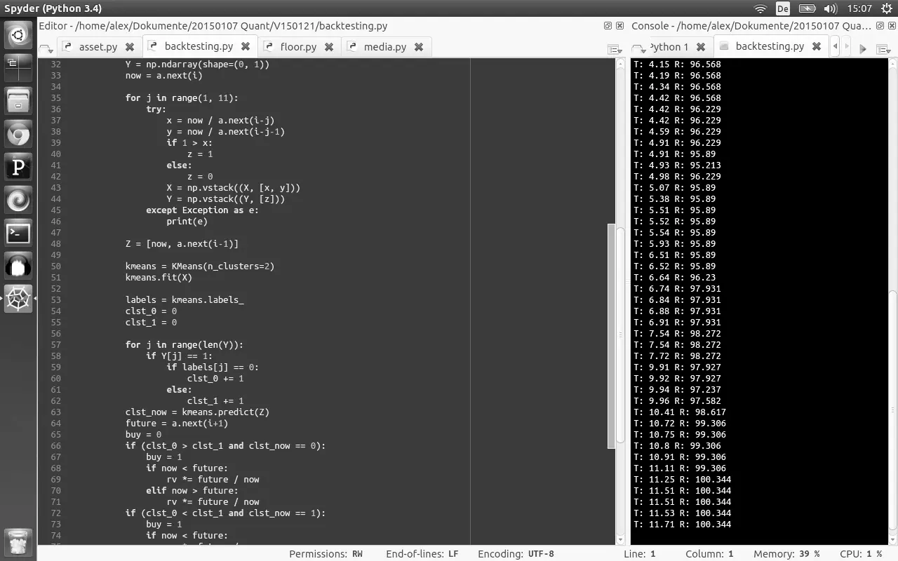
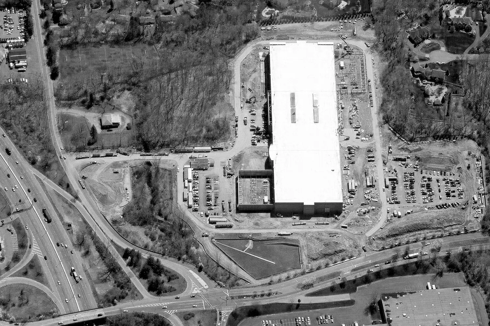
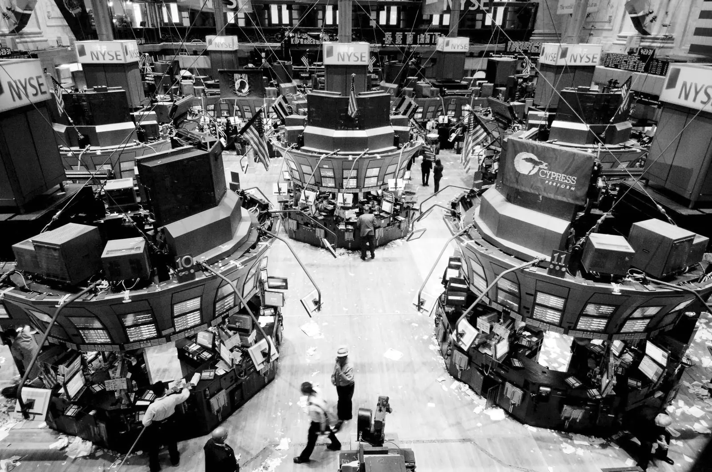
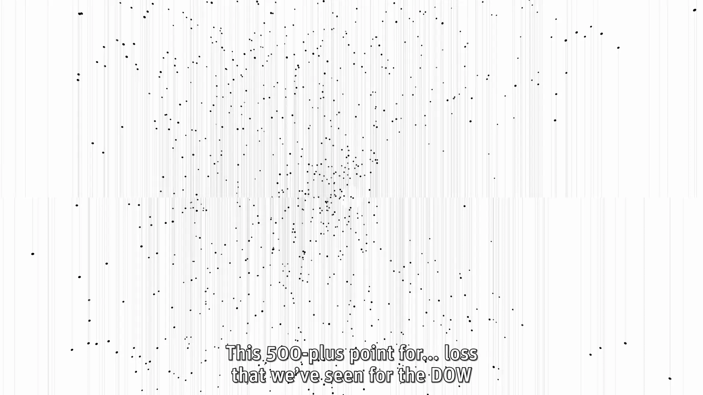

# Quant

| Key  | Value      |
| ---- | ---------- |
| Type | Short Film |
| Year | 2015       |

Data visualizations in the incomprehensible environment of the first algorithmic stock market crash. A movie from the point of view of a trading algorithm.

May 6, 2010, 02:42 pm. Without prior warning stock markets crashed heavily. The downward force was so brutal that almost no human trader could keep in game. Most stepped back and witnessed the surreal phenomenon which was the first of a kind: a crash uncoupled from economy or human behavior and motivations, triggered by trading algorithms. Complex systems, stuck in a feedback loop, forced prices down. Within fractions of a second, courses moved in a ranges they would manually in a couple of years. Unrealistic amounts of money was earned and burned within minutes.

Five years later, after official research was done, I revisited the flash crash as an artistic interpretation.

I gathered as much quantitative information as possible about the event and wrote a trading algorithm based on the actual trading data. The underlying ruleset is computed in a deep neural network, which would have earned in the market movements. The key point of this project is the visualization of the processes inside the algorithm. I built interfaces into my trading program, which were able to control data animations. My visualizations are bracketed in real-time found footage from CNBC and supported by generatively composed music.

