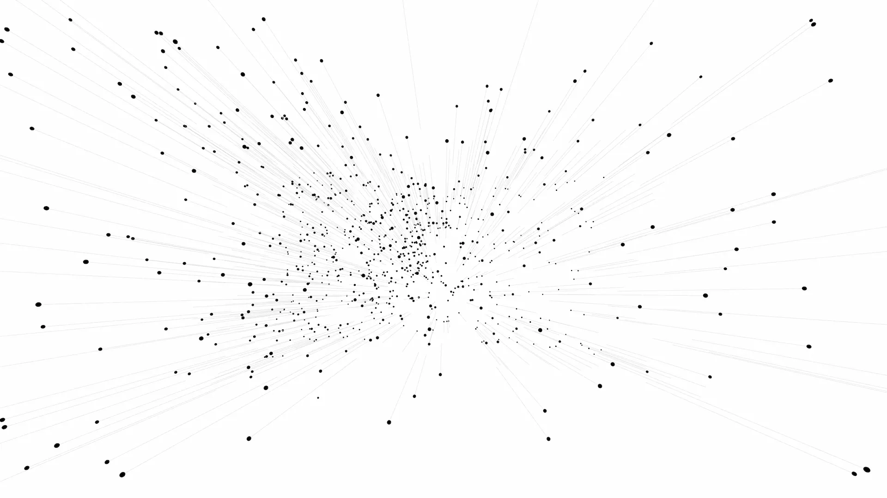
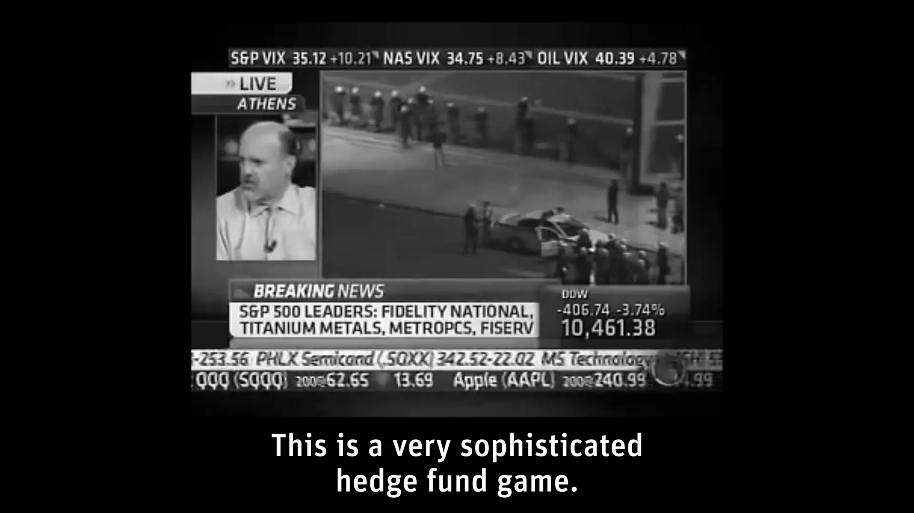

# Quant

| Key  | Value      |
| ---- | ---------- |
| Type | Short Film |
| Year | 2015       |

Data visualisations in the incomprehensible environment of the first algorithmic stock market crash. A film from the point of view of a trading algorithm.

6 May 2010, 02:42 pm. Without warning, the stock markets plummeted. The downward force was so brutal that almost no human trader could stay in the game. Most stepped back and witnessed the surreal phenomenon that was the first of its kind: a crash decoupled from the economy or human behaviour and motivations, triggered by trading algorithms. Complex systems, stuck in a feedback loop, forced prices down. In fractions of a second, prices moved in ranges that would have taken years to trade manually. Unrealistic amounts of money were made and burned within minutes.

Five years later, after the official investigation, I revisited the flash crash as an artistic interpretation.

I gathered as much quantitative information as I could about the event and wrote a trading algorithm based on the actual trading data. The underlying set of rules is computed in a deep neural network that would have learned from the market movements. The key point of this project is the visualisation of the processes inside the algorithm. I built interfaces into my trading program to control data animations. My visualisations are bracketed by real-time found footage from CNBC and supported by generatively composed music.

