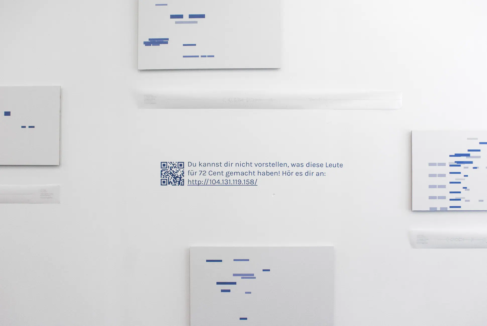
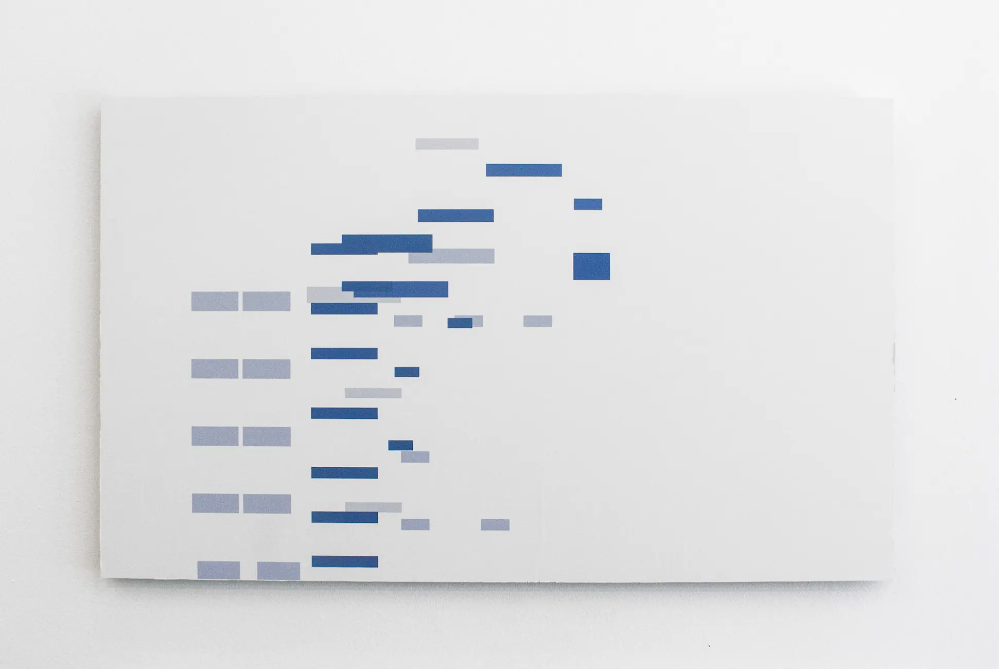
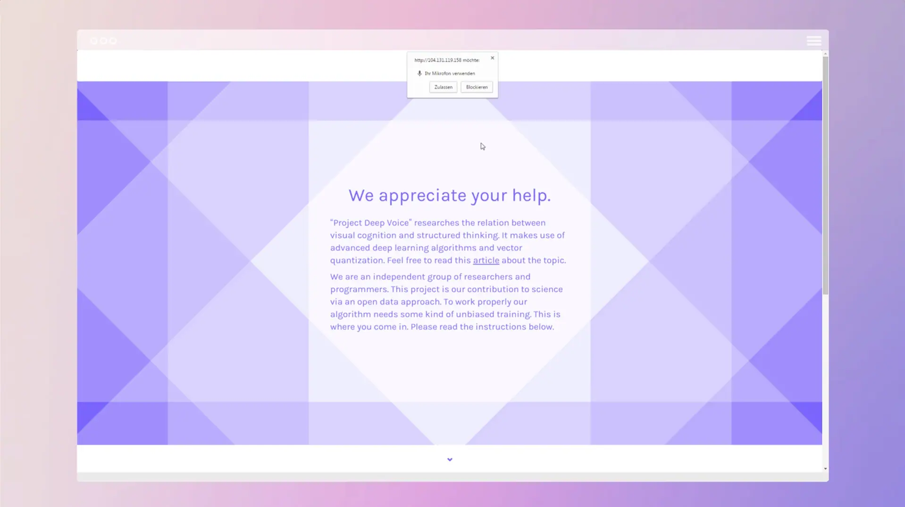
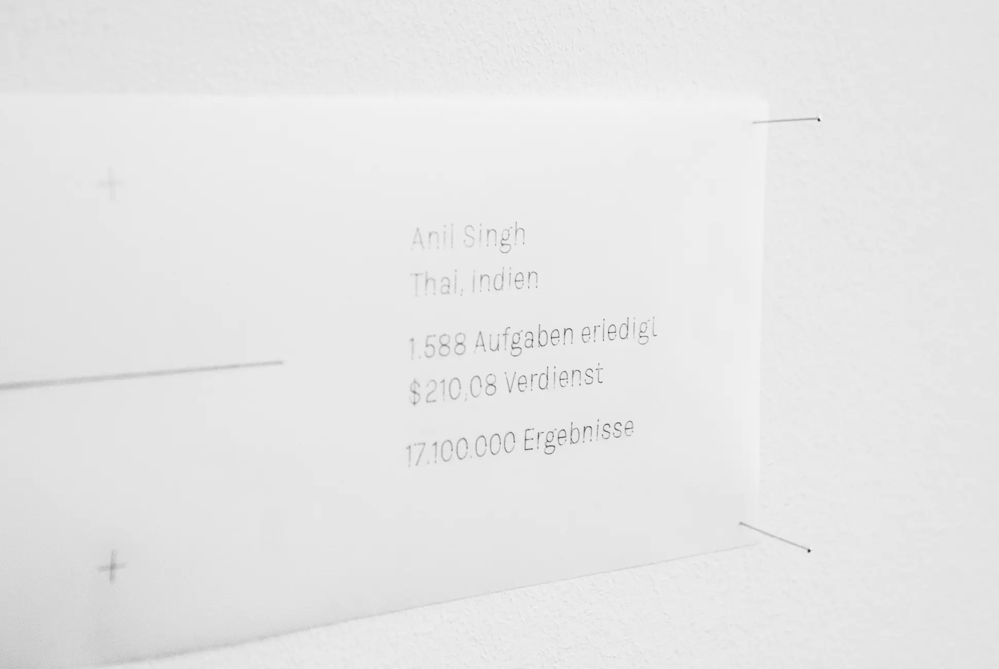
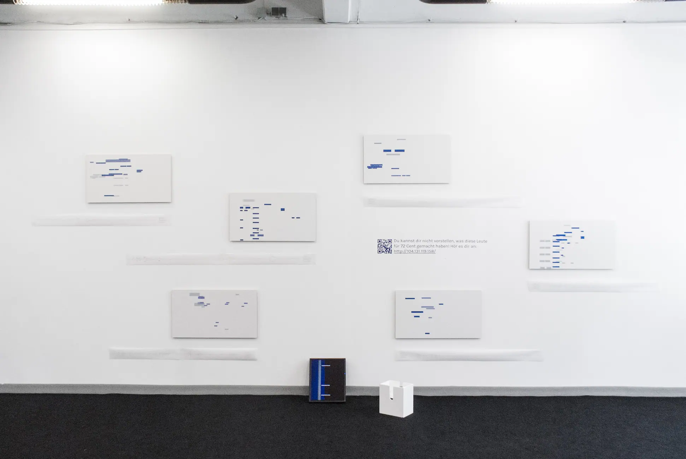
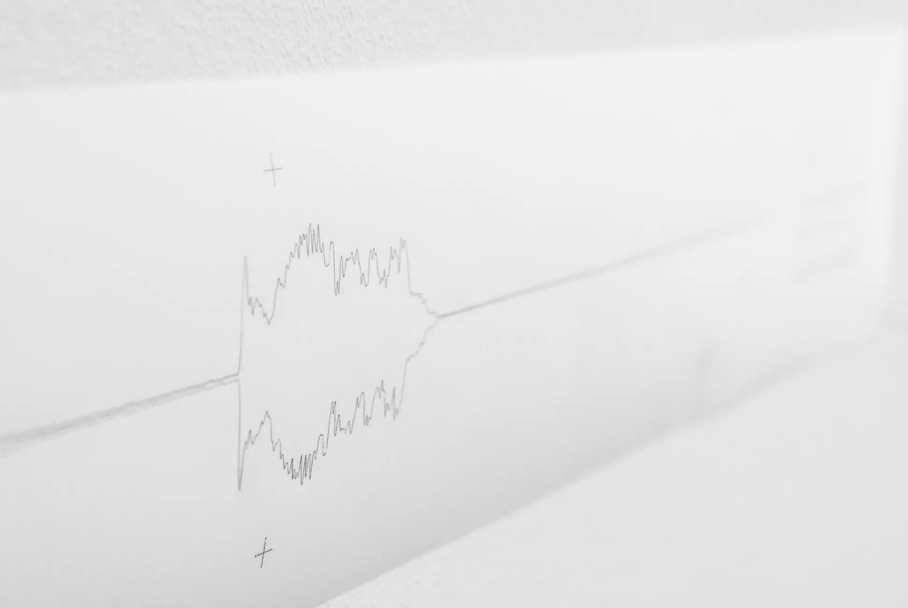
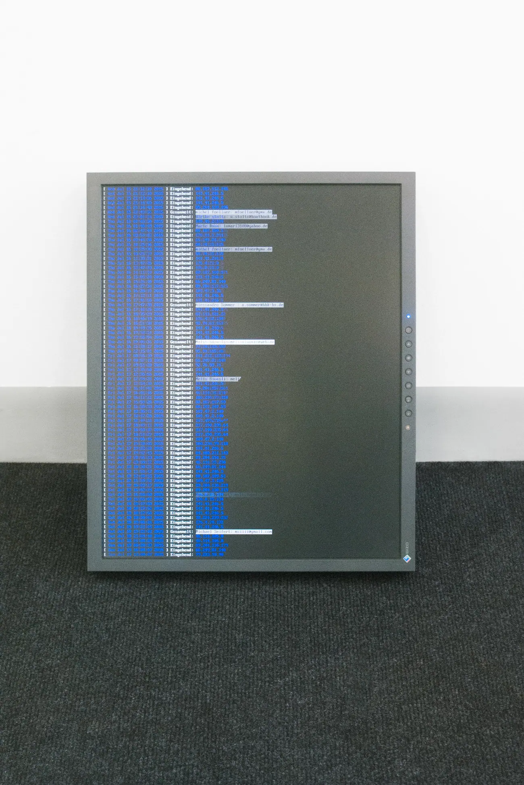

# Scamming people into being creative

| Key  | Value                    |
| ---- | ------------------------ |
| Type | Installation, Collection |
| Year | 2016                     |

> In order to maintain the performers' privacy, I will not publicly release the recordings.

Unintentional interaction and the lack of restraint to create out of nothing. A process of deceiving people for the yield of performative artefacts. A contemporary exploration of the possibilities of graphic notation and their interpretation.

This is a collection of nearly 40 works. Each piece consists of the same components - supposedly a graphic score and a sung or spoken interpretation by someone who doesn't know what they're doing. In an attempt to become a scammer, I supplemented this basis with illegally collected metadata about the performers from a crowdworking service. The result of my work was neither a score nor an interpretation, but the process of generating this collection.

My aim was to create a graphic score in a modern context. My inspiration was to create an homage to Earle Brown's work «December 1952». What is the connection between the visual component of the graphic scores and my preoccupation with identity on the Internet and Google in particular? These connections ultimately led me to my goal, the fraud. I wanted to find out as much as possible about the performer through the scores, forcing him to reveal his digital identity. Although the scores appear similar in form to Brown's original, my approach is based on a set of rules that can be seen as a summary of all the possible scores that have been created. To generate a score using the set of rules, you need the name of the performer and access to Google's search interface. Google then generates a list of about ten relevant links based on its page ranking algorithm. The rules required following each link back to the original page and analysing the content. If the name was found, the location and typographical dimensions were noted. Once all the web pages had been visited, a collection of coordinates and dimensions was created that resembled empty text markers. The rules placed these markers as blue rectangles on a white background. The higher the page rank, the more saturated the colour. The lower the page rank, the paler and brighter the colour. This resulted in overlapping, elongated blue rectangles on a white background, depending on the Google identity. In order to automate the ruleset, I integrated the algorithm into a web interface that would automatically run through all of the above steps using specific interfaces. This made applying the rules much less complex. In the web application, it was enough to fill in two text fields with first and last name and press a button to submit the information. After a short wait, the software displayed a graphic score generated from the user's name. For visual comparison: Brown drew his «December 1952» work with horizontal and vertical lines of varying thickness. My algorithm produced similar images, although vertical lines were not practical due to the nature of the text.

The mock project explored the relationship between seeing an abstract form and the immediate vocal articulation of what is seen, using a machine learning algorithm. In reference to the software used, I gave this mock project the simple but meaningful title «deep voice». What this technology does is irrelevant at this point, but it became one of the most influential areas of research in the coming years.

I programmed the necessary interfaces for a study website to embody the false story of the Deep Voice project, on the one hand to appear credible as a scientist, and on the other to place my algorithm. As a result, the website consisted of two parts. The first was used to describe the research project - with the following words We appreciate your help - Project Deep Voice explores the relationship between visual cognition and structured thinking. It uses advanced deep learning algorithms and vector quantization. «We are an independent group of scientists and programmers. This project is our contribution to science via an open data approach. To get the algorithm right, we need some kind of unbiased training. This is where you come in. Please read the instructions below.» In the footer of the page, I have added some genuine-sounding words about the apparent licence of our research. In order to convey the message «I do science» even more clearly, I chose a sterile but pleasant white and blue colour scheme for the website and a reduced, slightly playful but serious layout. Below the description I placed the second part, the interface to the algorithm. This consisted of the input fields described above for the name of the participant and the confirmation button. After successful input and hidden identity collection by the algorithm, the user saw the graphic score generated from their name and a record button in front of them. Once this button was pressed, the website recorded the user's auditory actions and could not be deactivated for 45 seconds. I considered the value of 45 seconds to be a reasonable amount of time for my performers and an optimal length for a sound work in a collection, and set it as a framework condition for participation in the experiment. The website then uploaded the audio file to my server.

I conceived my scam as a synthesis of the way Internet artists work and identity theft. In order to find a pool of people willing to participate in my experiment, I searched for a suitable crowdsourcing platform. In the erupting competition with Amazon Mechanical Turk, I found only one provider, Microworkers, that offered the freedom I needed for my task. My first impressions were mainly of the shady side of this service, which was certainly a strategy on their part and in my favour. To activate the account, Microworkers only needed a brief explanation of the project, which was answered with a personal and handwritten email. The microworkers were happy to work with me. Knowing that my work would be in a legal grey area, or possibly even completely illegal, I was concerned about lying to the platform provider, who knew my personal details, with my deep-voiced story. Working with them confirmed the dubious nature of the service, as I didn't seem to be the only one commissioning illegal activities on the web. The fact that other clients were sometimes very open about their intentions, for example to falsify online ratings or other statistics, reassured me a little, as I was a bit more discreet.

Once activated, I was given the opportunity to place orders, a simple process. A monetary deposit served as the basis against which a credit balance had to be paid in order to create jobs. A job consisted of a detailed description with clear instructions to make the workflow as efficient as possible for the crowdworkers, a payout associated with successful completion and a measurable, achievable parameter that served as a success criterion. For most jobs, this criterion required either a screenshot of the crowdworker's successful job or code generated after the job was completed. I asked for both. This allowed me to find out more about my workers - screenshots of desktops told me a lot about their owners. Once a crowdworker submitted a completed job, the client could release the amount to the worker if they were satisfied with the result. They even had the option of giving a kind of tip. I did this for particularly good results.

Typically, the amounts for crowdworking tasks on the platform were between 8 and 15 USD cents. This represented between two and ten minutes of work. These figures allowed me to rule out the possibility that my potential victims lived in Western or Northern Europe, or even North America, before placing the order. During the order creation process, Microworkers gave me the option of selecting specific countries or regions as my target group. I chose Southern Europe and Central Asia because the platform promised me reliable workers in these areas. Although I wanted to take an authentic, exploitative stance, I offered the crowdworkers 80 USD cents for my work. Not much, but well above the average for comparable work.

