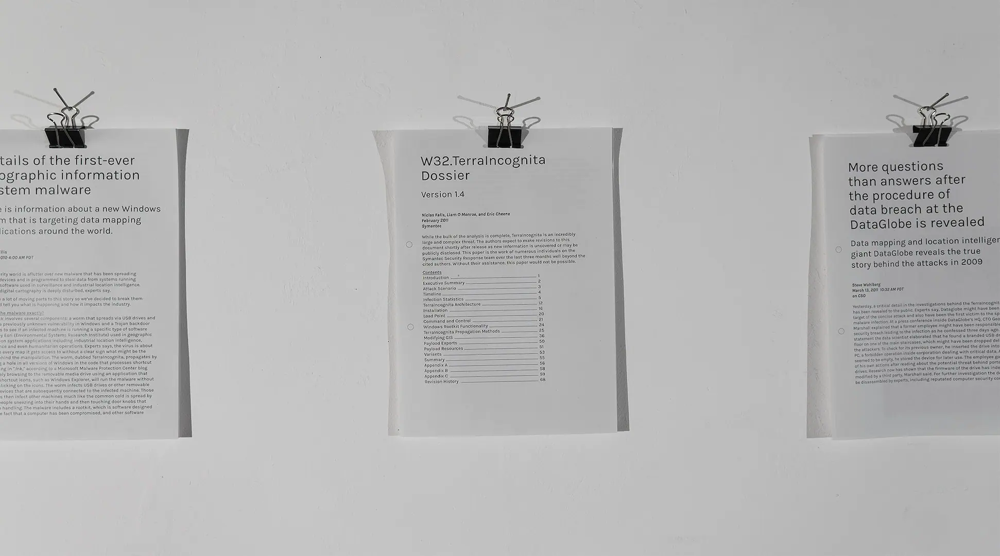
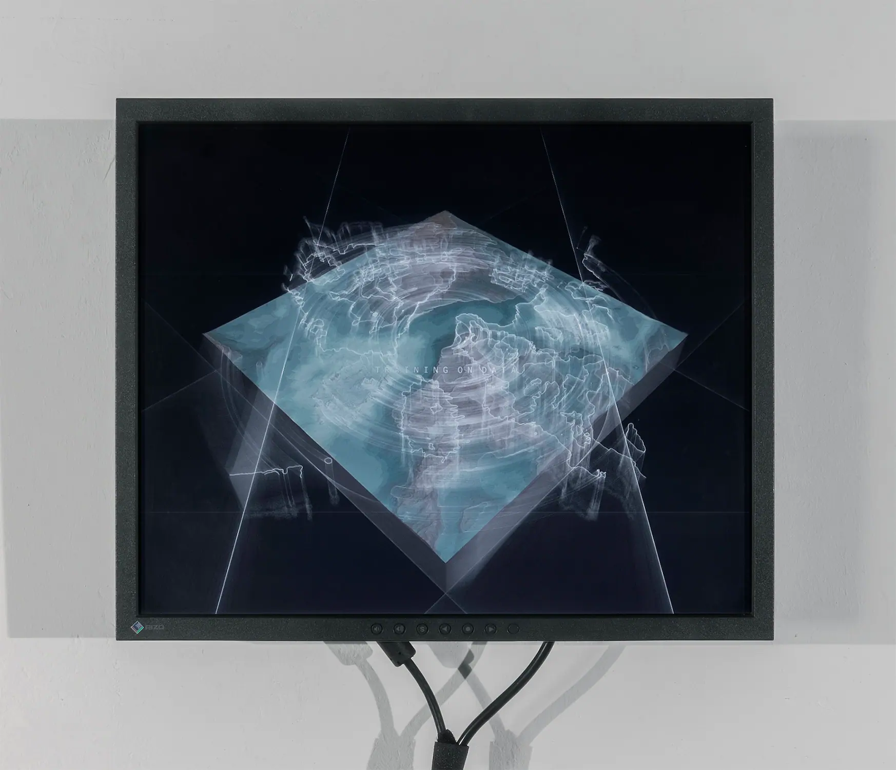
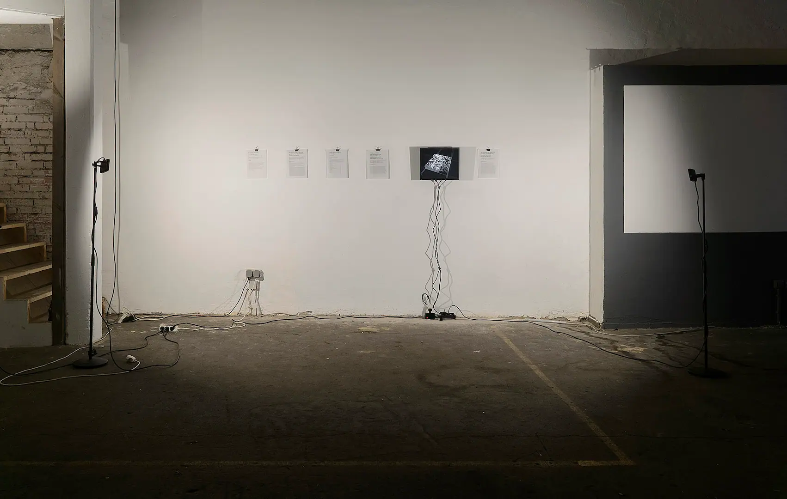
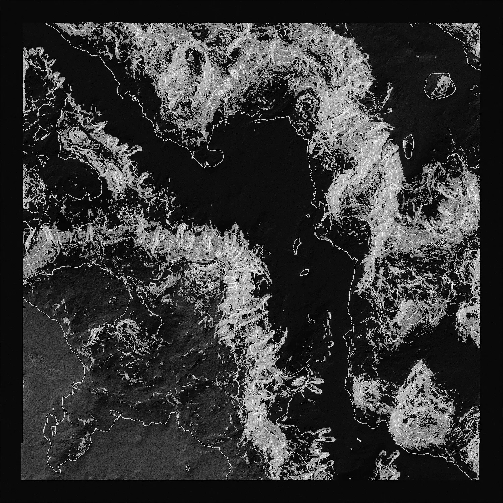
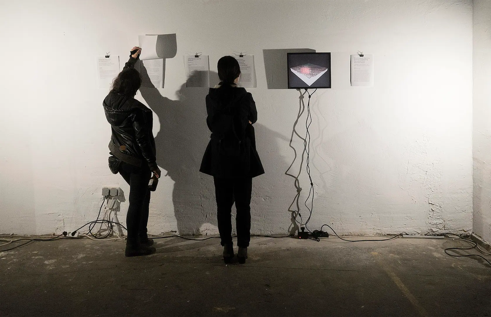
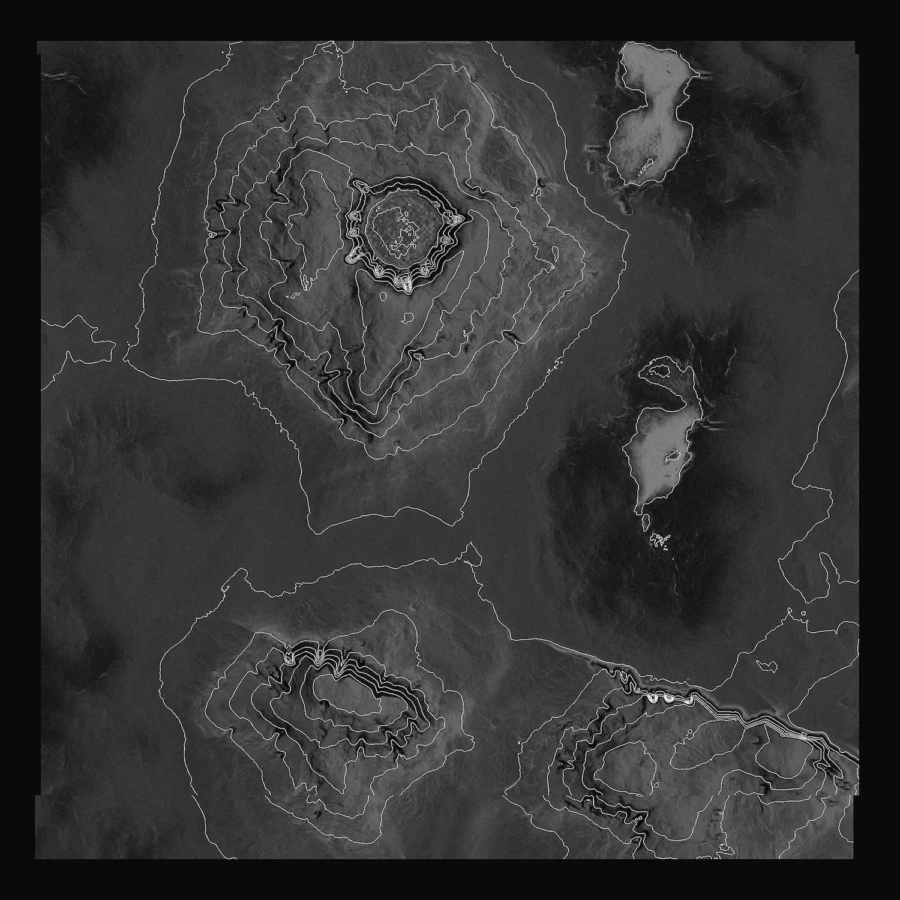

# TerraIncognita Dossier

| Key  | Value                    |
| ---- | ------------------------ |
| Type | Short Film, Installation |
| Year | 2017                     |

The TerraIncognita Dossier is a fictional narrative about cyber attacks on mapping services, in which a virus attempts to alter the digital representation of the Earth's surface for the benefit of a few. The project challenges our perception of space, the trustworthiness of digital data and the general intention of maps. A textual timeline of events unravels the events of the W32.TerraIncognita virus into an exciting cybersecurity story.

Maps allow us to see further than we can with our physical eyes. They are an artificial extension of our innate sense of spatial orientation. But this relationship is flawed: Usually unrecognisable, it has the potential to undermine our healthy sense of spatial reality. Often mistaken for a truthful representation of the world as such, we overlook a serious discrepancy between the ever-changing surface of our planet and a static collection of digital data from mapping services, manipulated by institutions of power and self-interest. It's a false assumption to think of maps as charitable devices created to help us - they are not scientific measurements. Maps draw boundaries, obscure political inconveniences, offer routes for exploitation, and lull us into false beliefs. Maps are power.

The TerraIncognita Dossier, as exhibited at FAQ in 2017, consists of a video loop and a narrative timeline of events surrounding the incidents in the form of five texts. The longest of the texts is the dossier itself, which describes the fictional attack on one of the largest digital mapping services and its technical prerequisites. The investigators suspect geopolitical interests behind the hacks, without being able to attribute responsibility to any institution. The video shows a cybersecurity company attempting to use machine learning to prove a correlation between mineral deposits and virus activity, suggesting a cover-up of environmental exploitation. The virus itself attempts to spread between services, so that no mapping provider remains unaffected. As a result, there's no guarantee that any digital map hasn't been tampered with, making it even harder to find traces of the infection. Other articles raise questions about the practical and civic implications, asking what the nature of digital maps really is.

The development of the project relied heavily on procedural generation, which made it possible to randomly generate images of pristine landscapes and rough terrain that are visibly manipulated by the virus. The generator was written from scratch in Processing and is capable of creating an infinite number of random sceneries. The narrative pays tribute to the non-fictional Stuxnet incidents, giving the narrative an uncanny possibility of coming true – either by fulfilling the technical requirements for an infectious attack on data centres, or by a large-scale institutional intention to achieve an unethical goal with the help of hacking.

